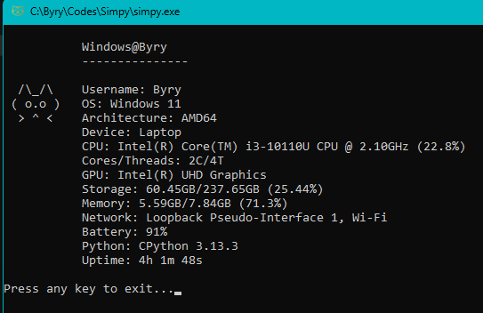

# Simpy 🐱‍💻

## A Simple Python Script inspired by neofetch and fastfetch for Windows

**Simpy** is a lightweight Python script that displays your system’s specifications, including CPU, GPU, RAM, storage, network, battery, Python version, and uptime with a fun ASCII art cat!  

---

## What It Does

It uses Python modules such as **psutil**, **platform**, **shutil**, and **wmi** to gather and display your system information in a clean, readable format.

**Features include:**  

- CPU specs
- GPU specs
- RAM usage and disk storage  
- Active network interfaces  
- Battery percentage (if present)  
- Python version and system uptime  
- Cute ASCII art display  

---

## How to Use It

1. You can just download the `simpy.exe` file
2. Double click to run the script

---

## Sample Output

---

## Notes

For `windows` system currently. This is a hobby project and is still being improved.

---

## Thank You!

Enjoy checking your system specs with a fun and simple Python script! 😸