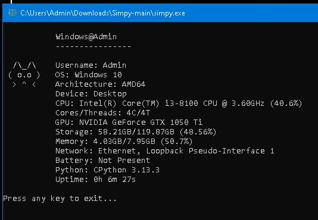

# 🐱‍💻 Simpy — Your Fun System Info Cat

## A Simple Python Script inspired by neofetch and fastfetch for Windows

**Simpy** is a lightweight Python script that fetches your Windows system info in style—CPU, GPU, RAM, storage, network, battery, Python version, and uptime—while displaying a cute ASCII cat. 😸 

---

## 🌟 Features

✨ **What Simpy Shows:**
- 🖥️ CPU specs & real-time usage
- 🎮 GPU details
- 💾 RAM & disk storage usage
- 🌐 Active network interfaces
- 🔋 Battery status (if present)
- 🐍 Python implementation & version
- ⏱️ System uptime
- 🐾 Cute ASCII cat for extra charm 

---

## 🚀 How to Run

1. Download the script or `simpy.exe`.
2. Double-click to run.
3. Watch your system info appear with a friendly cat! 🐱

---

## Sample Output

---

## 📝 Notes

- Windows-only (uses wmi for hardware info).
- Hobby project—improvements and contributions are welcome!
- Requires Python 3.6+ and modules: psutil, wmi, shutil, platform.

---

## 🙏 Thank You!

Simpy makes checking your system fun and cute 😺.
Enjoy your specs with style and maybe show it off to friends!