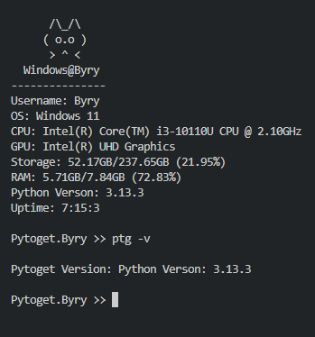

# Pytoget

## A Simple Python Script to Get the System's Data

**Pytoget** is a simple Python script that displays your system's specifications, such as CPU, GPU, RAM, and storage.

---

## What It Does

It utilizes Python's built-in modules such as **os**, **platform**, and **subprocess** to gather data about the device's specifications.

---

## Built-in Commands

| Command                 | Action                                      |
|-------------------------|---------------------------------------------|
| `q`, `quit`, or `exit`   | Terminates the program                      |
| `pytoget` or `ptg`       | Reruns the program                          |
| `pytoget -v` or `ptg -v` | Displays the script's version               |
| `cls`                    | Clears the entire console/terminal          |
| `cpu`                    | Shows detailed CPU specifications           |
| `gpu`                    | Shows detailed GPU specifications           |
| `rom`                    | Shows storage specifications                |
| `ram`                    | Shows detailed memory specifications        |

---

## How to Use It

1. Make sure **Python** is installed on your device.
2. Download the `.py` file and save it to your local machine.
3. Run the file (wait a few seconds for the system information to load).

---

## Sample Output

---

## Notes

This is a hobby project, and I am still working on improving and expanding it.

---

## Thank You!