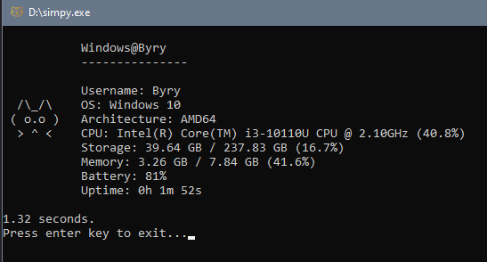

# 🐱‍💻 Simpy — Your Fun System Info Cat

A hundred lines Python script inspired by neofetch and fastfetch that stylishly displays key system info with an ASCII cat.

---

## 🌟 Features

✨ **What Simpy Shows:**
- 👤 User
- 🖥️ CPU
- 💾 RAM & disk usage
- 🔋 Battery status (if present)
- ⏱️ System uptime
- 😺 Cute ASCII cat for extra charm

---

## 🚀 How to Run

1. Download **[`simpy.exe`](https://github.com/Byry-2535/Simpy/raw/main/simpy.exe)**.
2. Double-click to run.
3. Watch your system info appear with a friendly cat!

---

## Sample Output

---

## 📝 Notes

- Simpy is a hobby project and may have rough edges.
- Hobby project—improvements and contributions are welcome!

---

## 🙏 Thank You!

Simpy makes checking your system fun and cute. Enjoy your specs with style and maybe show it off to friends!